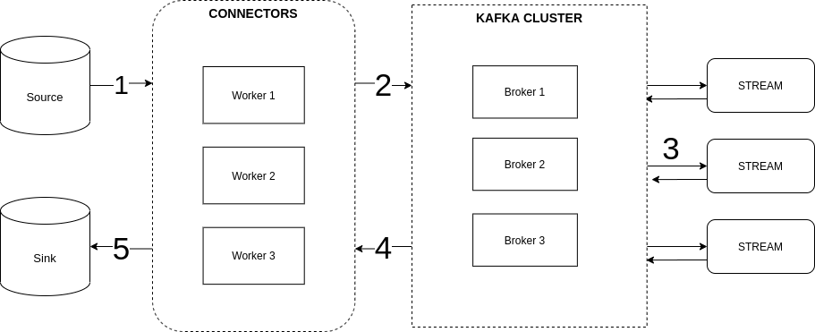

# Kafka playground


### Author
- [Linkedin profile](https://www.linkedin.com/in/tran-dung-076221179/)
Contact me if you have any questions or joining contributors

# 1. Messaging with Simple Publish Subscribe (pub/sub)
A publisher or multiple publisher write messages to many partitions and single or multiple consumer groups consume those messages.

**Consumer group** is a group of consumers, it can parallelise the data consumption.

When a new consumer joins to consumer group or remove a consumer, **rebalancing** happen

**Consumer group coordinator** implement rebalacing strategy and manage the state of the group. It auto rebalace message to appropriate consumer in each consumer group


**Producer cmd**

```
go run ./cmd/producer/producer.go --topic topic-name --partitions 1 --replicas 1
```

**You have to config kafka cluster when change number paritions and replicas > 1**


In case, you want to modify topic configuration ***manually*** after setting up kafka cluster, you can use kafka-cli to execute:

Add new topic
```
docker-compose exec broker kafka-topics --create --topic youtube --partitions 3 -replication-factor 3 --bootstrap-server broker:9092
```

Alter exist topic
```
docker-compose exec broker kafka-topics --alter --topic youtube --partitions 3 -replication-factor 3 --bootstrap-server broker:9092
```

Kafka doens't support reducing the number of paritions for a topic 

**Consumer cmd**

```
go run ./cmd/consumer/consumer.go --topic topic-name
```

# 2. Youtube streaming
A simple streaming model to collect videos data and sync data between **POSTGRESQL** and **ELASTICSEARCH**


**Prepare connector image**
The kafka connect base image only contain a few connectors. To add new connector, you need to build a new docker image that have new connectors installed.

***Docker file***
```
FROM confluentinc/cp-kafka-connect-base:6.0.0
RUN confluent-hub install --no-prompt confluentinc/kafka-connect-elasticsearch:10.0.1
```

***Build***

```
docker build . my-connect-image:1.0.0
```

***Prepare connector config***
```
{
  "name": "elastic-sink4",
  "config": {
    "connector.class": "io.confluent.connect.elasticsearch.ElasticsearchSinkConnector",
    "key.converter": "org.apache.kafka.connect.storage.StringConverter",
    "value.converter": "org.apache.kafka.connect.json.JsonConverter",
    "value.converter.schemas.enable": "false",
    "errors.retry.timeout": "-1",
    "topics": "youtube2",
    "connection.url": "http://elasticsearch:9200",
    "type.name": "_doc",
    "key.ignore": "false",
    "schema.ignore": "false",
    "transforms": "ExtractTimestamp",
    "transforms.ExtractTimestamp.type": "org.apache.kafka.connect.transforms.InsertField$Value",
    "transforms.ExtractTimestamp.timestamp.field": "timestamp"
  }
}
```

***Insert connector configuration***
```
./run.sh
```
Detail at https://docs.confluent.io/current/connect/managing/extending.html

***Create ksql stream***

```
CREATE STREAM youtube (
    kind VARCHAR,
    etag VARCHAR,
    id VARCHAR,
	snippet MAP<VARCHAR,VARCHAR>
  ) WITH (
    KAFKA_TOPIC='youtube2',
    VALUE_FORMAT='JSON'
  );
```

***Query elasticsearch***
```
curl -X GET "localhost:9200/_search?pretty&size=100" -H 'Content-Type: application/json' -d'
{
    "query": {
        "match_all": {}
    }
}
'
```
# 3. Kafka cluster

When a kafka client connect to one of brokers, it will auto connect to entire kafka cluster brokers. Kafka broker call **bootstrap server**.

**Zookeeper** responsible for managing kafka brokers, it perform partition leader election, and in-sync-replicas.
Furtherly it informs to **Kafka** if any configurations change happen (such as topics, paritions...).

***In production environment, you need to config **Zookeeper Cluster** too***


**Environment**
```
KAFKA_ZOOKEEPER_CONNECT: 'zookeeper:2181'
KAFKA_LISTENER_SECURITY_PROTOCOL_MAP: PLAINTEXT:PLAINTEXT,PLAINTEXT_HOST:PLAINTEXT
KAFKA_ADVERTISED_LISTENERS: PLAINTEXT://broker2:39092,PLAINTEXT_HOST://localhost:9093
```

You should notice to these env variables, it defines internal network and external network publish to client

# 4. Schema Registry

Producer sends bytes to kafka cluster, the consumers don't know any data that the producer sends, it has no verification and will break the consumer. In a distributed system it becomes very hard for evolving microservices and break consistency between other teams. That's why schema registry was created.


**Schema registry** provides restful interface for storing and retriving Avro, JSON, Protobuf schema between producer and consumer


### [Schema registry API usage](https://docs.confluent.io/current/schema-registry/develop/using.html)

List all subjects
```
curl -X GET http://localhost:8081/subjects
```
Example result:
```
["Kafka-value","Kafka-key"]
```

Get schema registered version of subject
```
curl -X GET http://localhost:8081/subjects/${subject-name}/versions/1
```
Delete schema version of subject

```
curl -X DELETE http://localhost:8081/subjects/${subject-name}/versions/1
```

### [Avro schema](https://avro.apache.org/docs/current/spec.html)

Avro schema form includes 4 fields: type, namespace, name, fields
``` Example
{
     "type": "record",
     "namespace": "com.example",
     "name": "FullName",
     "fields": [
       { "name": "first", "type": "string" },
     ]
} 
```
**Primitive Data Types** int, long, float, double, string, null, bytes, boolean

**Complex Data Types** record, enum, array, map, unions, fixed (fixed-sized field)

**"record"** represents an object 
``` 
{
     "type": "record",
     "namespace": "com.example",
     "name": "FullName",
     "fields": [
       { "name": "first", "type": "string" },
     ]
} 
```

**"enum"** defines enumerated values

```
{"type": "enum", "symbols": ["A", "B","C"]}
```

**"array"** defines an array fields with a type
```
{"type": "array", "items": "string"}
```

**"map"** defines key, value pairs. The key must be a string
```
{"type": "map", "values": "string"}
```

**"unions"** define a list of variable types
```
{"type": ["int", "string", "null"]}
```

**Logical Data Types** supported in Avro version 1.7.7
Provides more meaning with existing primitive types
- decimal (bytes)
- date (int)
- time-milis (long) number of miliseconds after midnight
- timestamp-milis (long) number of miliseconds from unix epoch

```
{"type": "int", "logicalType": "decimal"}
```

# 5. [Connect](https://docs.confluent.io/platform/current/connect/index.html)

Kafka Connect is used for streaming data between Kafka and other data system. It's simple, low latency, reliable and scalable. Kafka Connect can push large data sets in and out of Kafka. It becomes an integral component of ETL pipeline when combined with Kafka and streaming processing framework.



List of available connectors: https://www.confluent.io/hub
Kafka connect with schema registry: https://docs.confluent.io/platform/current/schema-registry/connect.html

### [Connect API Usage](https://docs.confluent.io/platform/current/connect/references/restapi.html)

Create a new connector

```
curl -X POST http://localhost:8083/connectors -H "Content-Type: application/json" -d @source/distributed/connector-json.json
```

Get connector information
```
curl -X GET http://localhost:8083/connectors/${connector-name}
```

There are 2 types of worker configuration: **standalone mode** and **distributed mode**

**Standalone Mode** is a single process that run connectors and tasks. For development purposes only.

**Distributed Mode** is multiple worker that run connectors and tasks, it's scalable and fault tolerant. If a worker dies, rebalance happen, tasks will be delivered to other workers. Use for **production**.

### Source connector

The source connector gives you the way to import data from any data sets and write to kafka topic

Create a new source connector
```
curl -X POST http://localhost:8083/connectors -H "Content-Type: application/json" -d @source/distributed/connector-json.json
```

**Example JDBC source connector**
```JDBC source connector allow import any relational database with JDBC driver
connector.class=io.confluent.connect.jdbc.JdbcSourceConnector
timestamp.column.name=[column_name1]
incrementing.column.name=[auto_increment_column]
table.whitelist=orders
mode=timestamp
topic.prefix=postgresql-source-connector-
connection.url=jdbc:postgresql://postgres:5432/postgres
connection.user=postgres
connection.password=password
key.converter.schemas.enable=false
value.converter.schemas.enable=false
value.converter=org.apache.kafka.connect.json.JsonConverter
key.converter=org.apache.kafka.connect.json.JsonConverter
```

### Sink connector

The Kafka sink connector allows you to export data from Kafka to any data sets

Create a new sink connector
```
curl -X POST http://localhost:8083/connectors -H "Content-Type: application/json" -d @sink/distributed/elastic-json.json
```

**Example Elastic sink connector with json schema less**
```Elastic sink connector no schema
connector.class=io.confluent.connect.elasticsearch.ElasticsearchSinkConnector
type.name=_doc
errors.retry.timeout=-1
topics=postgresql-source-connector-orders
transforms=ExtractTimestamp
key.ignore=true
schema.ignore=true
transforms.ExtractTimestamp.type=org.apache.kafka.connect.transforms.InsertField$Value
value.converter.schemas.enable=false
value.converter=org.apache.kafka.connect.json.JsonConverter
connection.url=http://elasticsearch:9200
key.converter=org.apache.kafka.connect.storage.StringConverter
transforms.ExtractTimestamp.timestamp.field=timestamp
```

**Query Elastic data**
```
curl -X GET "localhost:9200/_search?pretty&size=100" -H 'Content-Type: application/json' -d'{"query":{"match_all":{}}}'
```
